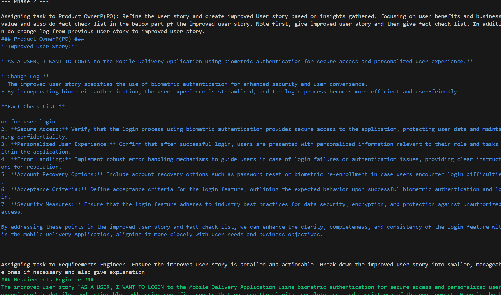
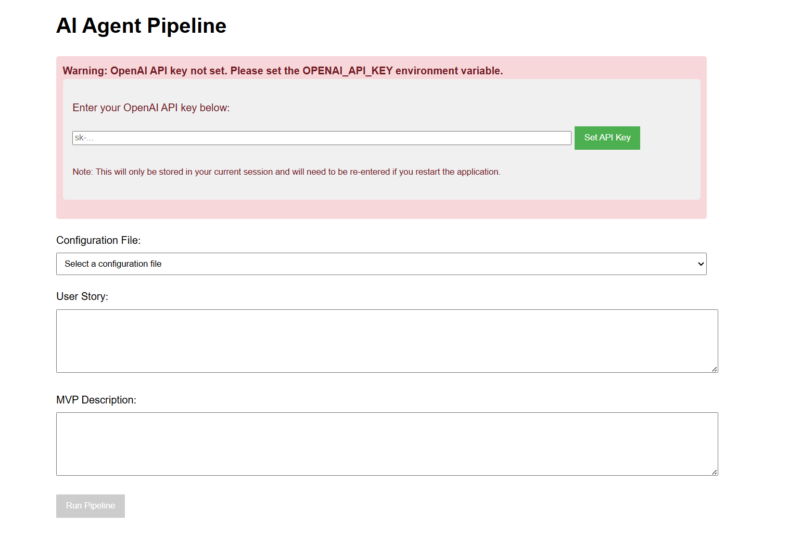

# AI Agent Pipeline for User Story Enhancement

An implementation of the Autonomous LLM-based Agent System (ALAS) for improving user story quality in agile software development. This system uses LLM-based agents to automate the enhancement of user stories through a collaborative agent framework.

## Overview

This implementation is based on the research paper **["LLM-based agents for automating the enhancement of user story quality: An early report" ](https://library.oapen.org/bitstream/handle/20.500.12657/90931/978-3-031-61154-4.pdf?sequence=1#page=126)**. The system uses specialized AI agents (Product Owner, Requirements Engineer) that work together to analyze and improve user stories, making them clearer, more complete, and better aligned with business objectives.

## Features

- **Multi-Agent Framework**: Implements specialized roles (Product Owner, Requirements Engineer) as AI agents
- **Structured Conversation**: Agents collaborate through a defined workflow
- **Quality Enhancement**: Improves user story clarity, specificity, and alignment with business goals
- **Web Interface**: User-friendly browser interface with real-time processing visualization
- **Command Line Interface**: Traditional CLI for scripting and automation

## Requirements

- Python 3.11 or higher
- OpenAI API key
- Required Python packages (listed in dependencies section)

## Installation

1. Clone the repository:

   ```bash
   git clone <repository-url>
   cd ai--agent
   ```

2. Install required dependencies:

   ```bash
   python -m pip install --user pipenv
   python -m pipenv install
   ```

3. Create a `.env` file in the project root directory with your OpenAI API key:
   ```
   OPENAI_API_KEY=your_openai_api_key_here
   ```

## Running the Application

### Terminal Command-Line Interface

To run the application from the command line:

1. Navigate to the project directory:

   ```bash
   cd ai--agent
   ```

2. Run the main script using pipenv:

   ```bash
   python -m pipenv run python src/main.py config/testv1.json -m mvp.txt
   ```

   Parameters:

   - `config/testv1.json`: Path to the configuration file
   - `-m mvp.txt`: Path to the MVP description file

   When prompted, enter your user story and type "END" when finished.

### Web Interface

To run the application with the web interface:

1. Navigate to the project directory:

   ```bash
   cd ai--agent
   ```

2. Install Flask dependencies:

   ```bash
   python -m pip install flask python-dotenv
   ```

3. Start the Flask application:

   ```bash
   cd src
   python -m flask run
   ```

4. Open your browser and navigate to:

   ```
   http://127.0.0.1:5000
   ```

5. In the web interface:
   - Select a configuration file from the dropdown
   - Enter your user story in the first text area
   - Enter your MVP description in the second text area
   - Click "Run Pipeline" to start the process
   - Watch the real-time output as agents analyze and improve your user story
   - Use the "Stop Processing" button if needed
   - Copy the output using the "Copy Output" button when done

## Output Image

  
**Figure:** Output in terminal

  
**Figure:** Output in web browser

## Configuration

The system uses JSON configuration files to define the agent pipeline. Configuration files are stored in the `config/` directory.

Example configuration structure:

```json
{
  "agent_order": ["Product OwnerP(PO)", "Requirements Engineer"],
  "agents": [
    {
      "name": "Product OwnerP(PO)",
      "color": "BLUE",
      "max_history": 999,
      "system": "",
      "user": "From now on, you will play the role of a Product Owner, a vital member of a software development team responsible for defining and prioritizing product features... "
      },
      "temperature": 1.0,
      "top_p": 0.1
    },
    {
      "name": "Requirements Engineer",
      "color": "GREEN",
      "max_history": 999,
      "system": "",
      "user": "From now on, you will play the role of a Requirements Engineer, a new version of AI model that is capable of analyzing, documenting, and managing software requirements. In order to do that, you will gather and validate requirements, collaborate with stakeholders, and ensure that the software meets the needs and expectations of the users..."
      },
      "temperature": 1.0,
      "top_p": 0.2
    }
  ],
  "iterations": 5,
  "max_tokens_per_call": 3000,
  "openai_model": "gpt-3.5-turbo"
}
```

## Research Implementation

This project implements the Autonomous LLM-based Agent System (ALAS) as described in the research paper. The implementation includes:

1. **Reference Model**: Following the agent-based reference model from the paper
2. **Task Preparation Phase**: Setting up agent profiles, task descriptions, and planned interactions
3. **Task Conduction Phase**: Executing the collaborative agent workflow
4. **GPT Models**: Using GPT-3.5-Turbo and GPT-4 models as underlying LLMs for agents

## Troubleshooting

### API Key Issues

If you encounter API key errors:

1. Ensure your OpenAI API key is correctly set in the `.env` file
2. For the web interface, you can also enter the API key directly in the provided form
3. Verify your API key has sufficient quota and permissions

### Command Not Found

If you see "command not found" errors:

1. Make sure Python is installed and in your PATH
2. Use the module approach: `python -m pipenv` instead of just `pipenv`
3. Use the module approach for Flask: `python -m flask run` instead of just `flask run`

### Encoding Issues

If you encounter encoding errors with special characters:

1. Ensure your text files are saved with UTF-8 encoding
2. The web interface automatically handles encoding issues
3. Contact me: maruf.rayhan14@gmail.com

## Research Paper

This implementation is based on the research paper "LLM-based agents for automating the enhancement of user story quality: An early report". The paper introduces a reference model for an Autonomous LLM-based Agent System (ALAS) and demonstrates its effectiveness in improving user story quality within agile teams. For using the code please cite the paper. My contact: maruf.rayhan14@gmail.com
